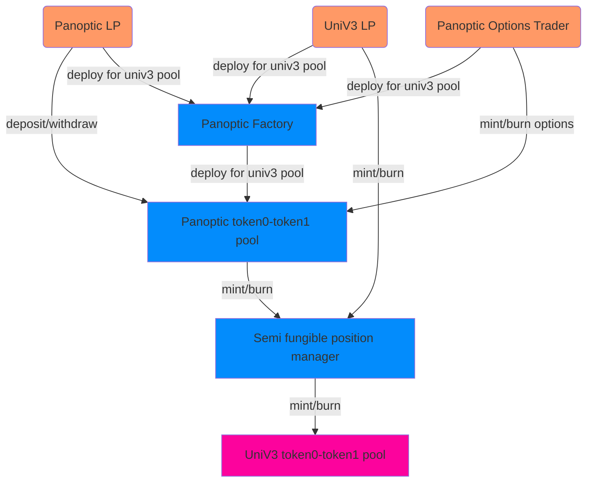

# Panoptic Finance

[](https://coveralls.io/github/advancedblockchain/Panoptic)

Panoptic is a governance-minimized options trading protocol. It enables the permissionless trading of perpetual options on top of any asset pool in the Uniswap v3 ecosystem. The Panoptic protocol is noncustodial, has no counterparty risk, offers instantaneous settlement, and is designed to remain fully-collateralized at all time.



# How to run

This is an ongoing development and documentation and functionalities will be added soon.

Currently, you can compile the contracts by doing

```shell
npx hardhat compile

```

or directly

```shell
yarn compile
```

For running tests

```shell
NODE_URL=<URL to archive node> yarn test
```

# Contract description

Current contract implementation is a POC for managing uniswap v3 liquidity with the erc721 interface that wraps them.

We leverage the `NonFungiblePositionManager` (NFPM) contract provided by uniswap to interact with the real liquidity. This contract is deployed on every chain the univ3 protocol is officially running.

Our contract holds the ownership of the erc721 tokens that reference the liquidity positions, and we store information regarding the position in the `Deposit` struct.

```solidity
struct Deposit {
  address owner;
  uint128 liquidity;
  address token0;
  address token1;
}

```

All the information regarding the position can be also found in the NFPM contract, but we store it here for easy access. The owner address is the previous owner of the nft, or the creator of the position.

Currently we implement the following functions. All of them are propperly documented with all the parameters needed and return values, but here is a briev overview of the functionalities:

## Fallback `onERC721Received(...)`

Implemented so that if the contract receives a univ3 position nft, we are able to record the information on our deposits, taking the previous owner of the nft as reference, and ensuring that this nfts can only be transfered from the NFPM.

## Internal `_createDeposit(...)`

Helper function to get the needed info from the nft, and store it in our records of deposits

## Internal `_collectFees(...)`

Helper function to collect all the fees from a certain token, with an option to either store those tokens in the contract or send them back to the recorded owner of the position.

## Internal `_removeLiquidity(...)`

Helper function to withdraw an amount from the liquidity of the position (can be all), with an option to either store those tokens in the contract or send them back to the recorded owner of the position.

## Internal `_sendToOwner(...)`

Helper function to send some liquidity tokens back to the owner of a position.

## External `mintNewPosition(...)`

Used by external users to mint a new position. This will create a new position nft that will be held by our contract, and record the real owner in the deposits.

User needs to approve our contract for the spending of the tokens, and we interact with the NFPM to create a new position.

Tokens that are not included in the position, are returned to the original user.

This function needs to be extended to take into account slippage, since now we are not checking the final amounts.

Currently liquidity is provided on the full range, but the function is easily adapted to specify the upper and lower ticks.

## External `collectAllFees(...)`

Allows any user to start a collection of the fees of a position. This fees will be stored in the contract, so the user does not get any benefit from doing this.

## External admin `decreaseLiquidityInHalf(...)`

An example usage of the internal function to decrease part of the liquidity, while keeping the position open. Tokens are stored on the contract as well.

## External admin `removeLiquidityAndBurn(...)`

Withdraws all the pending liquidity in a position and the fees pending to be collected. Then burns the nft and the position is liquidated.

## External admin `refundNFT(...)`

Sends the erc721 liquidity position token back to the owner of the position and removes the info stored in our deposits.

## External `increaseLiquidityCurrentRange(...)`

Adds liquidity to an existing position, but the range is not modified.

Any user can provide liquidity to any token, but there is no change in ownership.... so they can gift liquidity to other positions.
