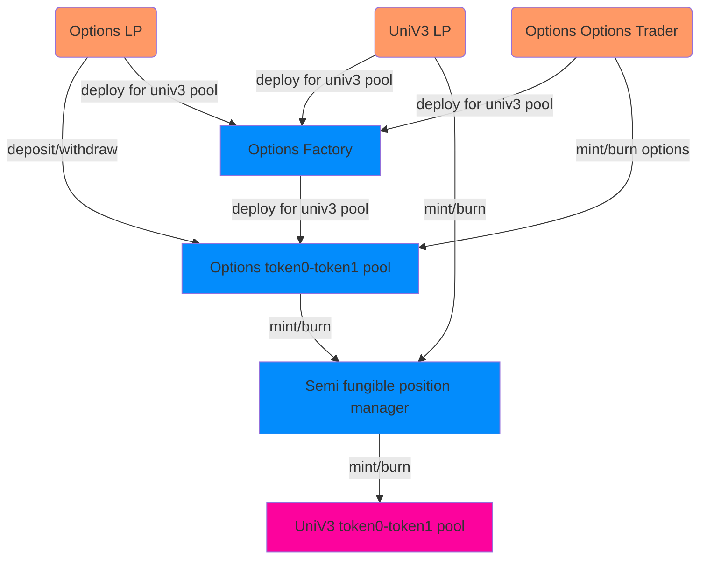

# Options Finance

[](https://coveralls.io/github/advancedblockchain/Options)

Options is a governance-minimized options trading protocol. It enables the permissionless trading of perpetual options on top of any asset pool in the Uniswap v3 ecosystem. The Options protocol is noncustodial, has no counterparty risk, offers instantaneous settlement, and is designed to remain fully-collateralized at all time.



# How to run

This is an ongoing development and documentation and functionalities will be added soon.

Currently, you can compile the contracts by doing

```shell
npx hardhat compile

```

or directly

```shell
yarn compile
```

For running tests

```shell
NODE_URL=<URL to archive node> yarn test
```

